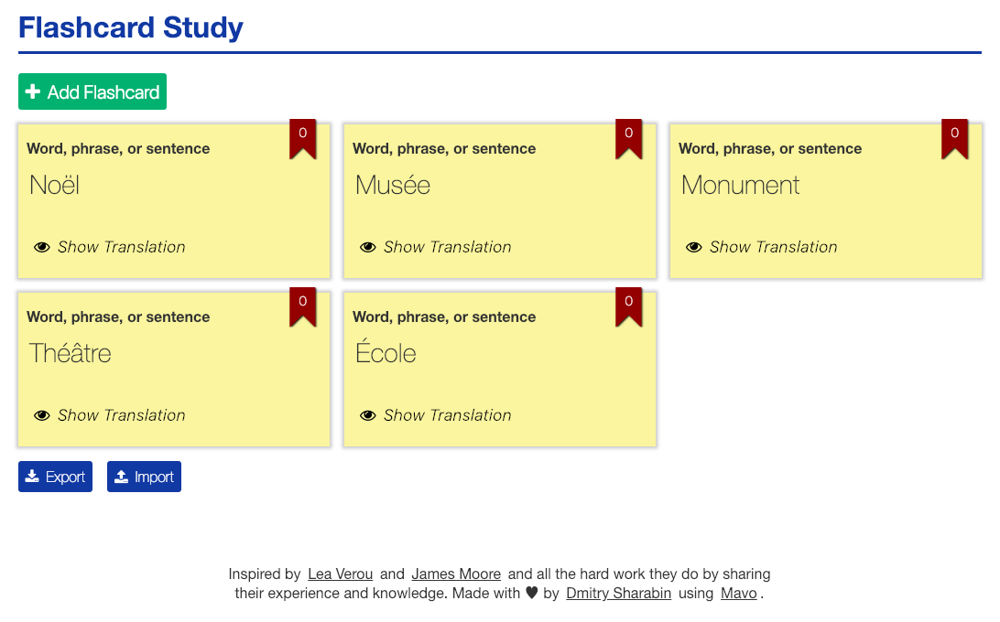
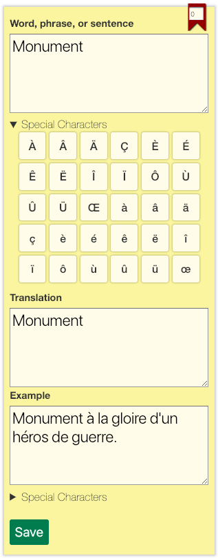
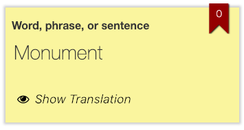
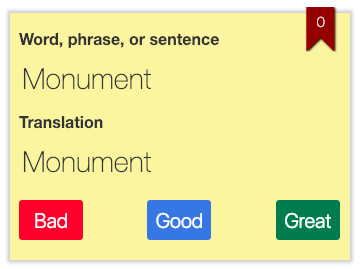

# Mavo flashcard Study App

## Features

This app is dedicated to those who study foreign languages (e.g. French).

Working with the app you are able to:

- create new flashcards
- edit flashcard source phrase, translation and examples
- add special characters to the source phrase when needed
- edit rank when needed

- delete flashcards
- rearrange flashcards

- delete all flashcards
- import and export flashcards

- reveal translation and examples when needed

- self-grade your own translation

Flashcards move depending on the ranking after self-grading:

- in case you choose **Bad** answer, rank becomes equal to 0, and the flashcard moves to the beginning
- in case you choose **Good** Answer, rank increases by 1, and the flashcard doesn't move
- in case you choose **Great** Answer, rank increases by 2, and the flashcard moves to the end

## License

The content of this repository is licensed under a [MIT License](https://opensource.org/licenses/MIT).
