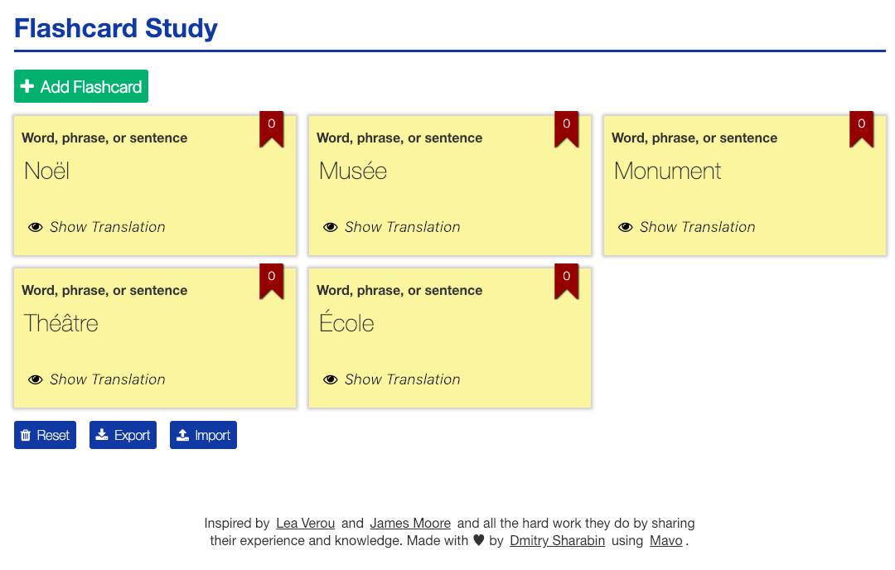
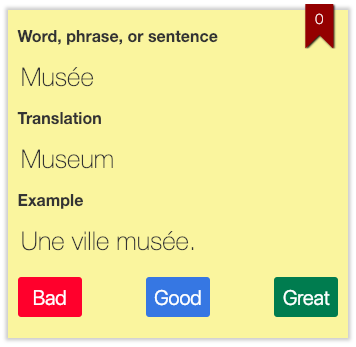

# Mavo Flashcard Study App

## Features

- Create new Flashcards.
- Edit Flashcard source phrases and translations.
- Special characters added when needed.
- Rank edited when needed.

- Delete Flashcards.
- Rearrange Flashcards.

- Import and Export Flashcards.

- Translation shown when requested.

-  Ability to self grade your own translation.

-  Move Flashcards by answer ranking:
   **Bad** Answer → Rank = 0 (the card moves at the beginning),
   **Good** Answer → Rank = Rank + 1 (the card doesn't move),
   **Great** Answer → Rank = Rank + 2 (the card moves at the end).

## License

The content of this repository is licensed under a [MIT License](https://opensource.org/licenses/MIT).
